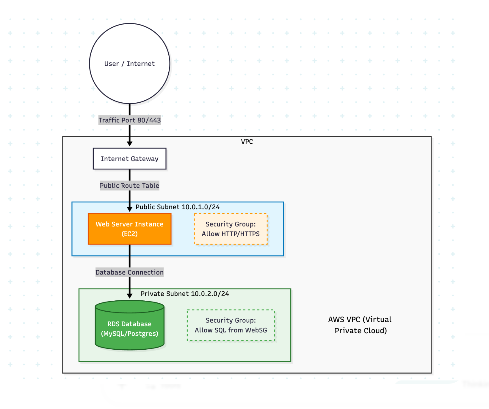

# AWS 2-Tier Infrastructure with DevSecOps Pipeline

A secure, production-ready two-tier web application infrastructure deployed on AWS using **Terraform**, managed via **GitHub Actions** with integrated security scanning.




## 🏗️ Architecture Overview

This project implements a classic 2-tier architecture with clear separation between web and database layers, fully automated via CI/CD.

- **Web Tier**: Public-facing EC2 instance running Nginx (Ubuntu 22.04) in a public subnet
- **Database Tier**: RDS PostgreSQL database isolated in a private subnet
- **State Management**: Terraform state is stored securely in an **S3 Bucket** (Remote Backend)
- **CI/CD**: GitHub Actions orchestrates the deployment and security checks

## 📋 Infrastructure Components

| Component | Specification | Purpose |
|-----------|--------------|---------|
| **Region** | `ap-northeast-3` (Osaka) | Target deployment region |
| **VPC** | `10.0.0.0/16` | Isolated network environment |
| **Public Subnet** | `10.0.1.0/24` | Hosts web server with internet access |
| **Private Subnet** | `10.0.2.0/24` | Hosts database (No internet access) |
| **EC2 Instance** | `t2.micro` | Web server with Nginx auto-installed |
| **RDS Database** | `db.t3.micro` (PostgreSQL 16.11) | Relational database service |
| **Security Groups** | Strict Inbound/Outbound rules | Firewall configuration |

## 🚀 DevSecOps Pipeline (CI/CD)

This project uses **GitHub Actions** to automate the infrastructure lifecycle with integrated security scanning.

### Workflow Steps:
1. **Checkout Code**: Pulls the latest code from the repository
2. **Setup Terraform**: Installs the specified version of Terraform
3. **Init**: Initializes Terraform and connects to the S3 Remote Backend
4. **Validate**: Checks Terraform syntax and configuration
5. **Format Check**: Verifies code formatting standards
6. **🛡️ Security Scan (SAST)**: Uses `tfsec` to scan for security vulnerabilities before deployment
7. **Plan**: Generates an execution plan
8. **Apply**: Deploys changes to AWS (only on `push` to `main`)

## 🔒 Security Features

### Network & Access Control
- ✅ **Private Isolation**: Database resides in a private subnet with no Route Table to the Internet Gateway
- ✅ **Least Privilege**: Database Security Group only accepts traffic on port **5432** from the Web Server's Security Group
- ✅ **State Security**: Terraform state is locked and stored remotely in S3, preventing local state file risks
- ✅ **Multi-AZ Deployment**: Resources distributed across availability zones for fault tolerance

### Security Scanning & DevSecOps
- ✅ **Shift-Left Security**: Integrated `tfsec` into the pipeline to detect misconfigurations early
- ✅ **Automated Validation**: Terraform validate and format checks in CI/CD
- ✅ **Secret Management**: Sensitive data stored in GitHub Secrets, not in code
- ✅ **Infrastructure as Code**: Version-controlled, auditable infrastructure changes

## 🛠️ Deployment Instructions

This project uses **automated CI/CD deployment** - no manual `terraform apply` required.

### Prerequisites
1. AWS Account with appropriate permissions
2. S3 Bucket created for Terraform State storage
3. GitHub Repository with Actions enabled

### Step 1: Configure GitHub Secrets
Go to **Settings > Secrets and variables > Actions** and add:

| Secret Name | Description |
|-------------|-------------|
| `AWS_ACCESS_KEY_ID` | Your AWS Access Key ID |
| `AWS_SECRET_ACCESS_KEY` | Your AWS Secret Access Key |
| `2_tier_secret` | The password for the RDS PostgreSQL Database |

### Step 2: Deploy via Git Push
Simply commit and push your changes to the `main` branch:

```bash
git add .
git commit -m "feat: Update infrastructure"
git push origin main
```

The GitHub Action will automatically:
- Validate Terraform code
- Run security scans
- Deploy infrastructure changes
- Provide deployment outputs

## 📊 Project Completion Checklist

### ✅ Phase 1: Foundation (Completed)
- [x] VPC & Subnet Segmentation (Public/Private)
- [x] Internet Gateway & Routing configuration
- [x] EC2 Web Server Deployment (Ubuntu + Nginx)
- [x] RDS PostgreSQL Database Deployment

### ✅ Phase 2: DevSecOps Automation (Completed)
- [x] **Remote Backend**: S3 state storage configured
- [x] **CI/CD Pipeline**: GitHub Actions workflow implemented
- [x] **SAST Scanning**: Integrated tfsec for security auditing
- [x] **Secret Management**: GitHub Secrets for credentials
- [x] **Validation Pipeline**: Automated syntax and format checking

## 💰 Cost Estimation (ap-northeast-3)

| Resource | Type | Approx. Monthly Cost |
|----------|------|---------------------|
| **EC2** | t2.micro | ~$8.50 (Free Tier eligible) |
| **RDS** | db.t3.micro | ~$12.50 (Free Tier eligible) |
| **S3** | Standard | < $0.05 (State file storage) |
| **Data Transfer** | Minimal | ~$1.00 |
| **Total** | | **~$22/month** |

*Note: Costs are estimates. Use AWS Cost Explorer for actual usage monitoring.*

## 📁 Project Structure

```
terraform-2-tier-infrastructure/
├── .github/workflows/
│   └── terraform.yaml       # CI/CD Pipeline Configuration
├── main.tf                  # Core resources (VPC, EC2, RDS)
├── variables.tf             # Variable definitions
├── outputs.tf               # Output values (IPs, Endpoints)
├── provider.tf              # AWS Provider & S3 Backend config
├── terraform.tfvars         # Variable values (gitignored)
├── secure-vpc.png           # Architecture diagram
└── README.md               # Project Documentation
```

## 🔗 Access & Verification

### Web Server Access
Once deployed, the pipeline outputs the Web Server Public IP:
```bash
# View website
curl http://<web_public_ip>
# Expected: "Deployed via Terraform"
```

### Database Connection
The PostgreSQL database is **private** and only accessible from the EC2 instance:
```bash
# SSH to web server
ssh ubuntu@<web_public_ip>

# Install PostgreSQL client
sudo apt-get update && sudo apt-get install -y postgresql-client

# Connect to database
psql -h <rds_endpoint> -U dbadmin -d mydb
```

## 📝 Lessons Learned & Troubleshooting

### Deployment Challenges Resolved
1. **PostgreSQL Version**: Initial version 16.1 unavailable in ap-northeast-3 → Used 16.11
2. **Reserved Username**: "admin" reserved in PostgreSQL → Changed to "dbadmin"
3. **Port Configuration**: Updated security group from MySQL (3306) to PostgreSQL (5432)
4. **S3 Backend Region**: Bucket in us-east-1 but backend configured for ap-northeast-3 → Updated backend region

### Security Improvements Implemented
- Integrated tfsec security scanning in CI/CD pipeline
- Implemented least privilege security group rules
- Added Terraform validation steps
- Configured remote state storage with S3

## 🔄 Next Steps & Roadmap

### Phase 3: Enhanced Security & Monitoring
- [ ] Add Checkov for additional policy-as-code validation
- [ ] Implement pre-commit hooks for local validation
- [ ] Add CloudWatch monitoring and alerting
- [ ] Enable RDS encryption at rest
- [ ] Implement backup strategies

### Phase 4: Production Readiness
- [ ] Add NAT Gateway for private subnet updates
- [ ] Implement Auto Scaling Groups for high availability
- [ ] Add Application Load Balancer
- [ ] Set up AWS Config for compliance monitoring
- [ ] Implement disaster recovery procedures

## 🏆 DevSecOps Achievements

This project successfully demonstrates:
- ✅ **Infrastructure as Code** with Terraform
- ✅ **Automated CI/CD** with GitHub Actions
- ✅ **Security Scanning** with tfsec integration
- ✅ **Shift-Left Security** practices
- ✅ **Remote State Management** with S3
- ✅ **Secret Management** with GitHub Secrets
- ✅ **Network Security** with proper segmentation

## 📚 References & Documentation

- [AWS VPC Best Practices](https://docs.aws.amazon.com/vpc/latest/userguide/vpc-security-best-practices.html)
- [Terraform AWS Provider](https://registry.terraform.io/providers/hashicorp/aws/latest/docs)
- [RDS PostgreSQL Documentation](https://docs.aws.amazon.com/AmazonRDS/latest/UserGuide/CHAP_PostgreSQL.html)
- [GitHub Actions Documentation](https://docs.github.com/en/actions)
- [tfsec Security Scanner](https://aquasecurity.github.io/tfsec/)

## 📄 License

This project is for educational and portfolio purposes.

## 👤 Author

**Jira-saki** - DevSecOps Engineer  
*Specializing in Infrastructure as Code and Automated Security*

---

**Project Status**: 🚀 **Production-Ready DevSecOps Pipeline**  
**Last Updated**: December 2025  
**Pipeline Status**: ✅ Automated Deployment Active